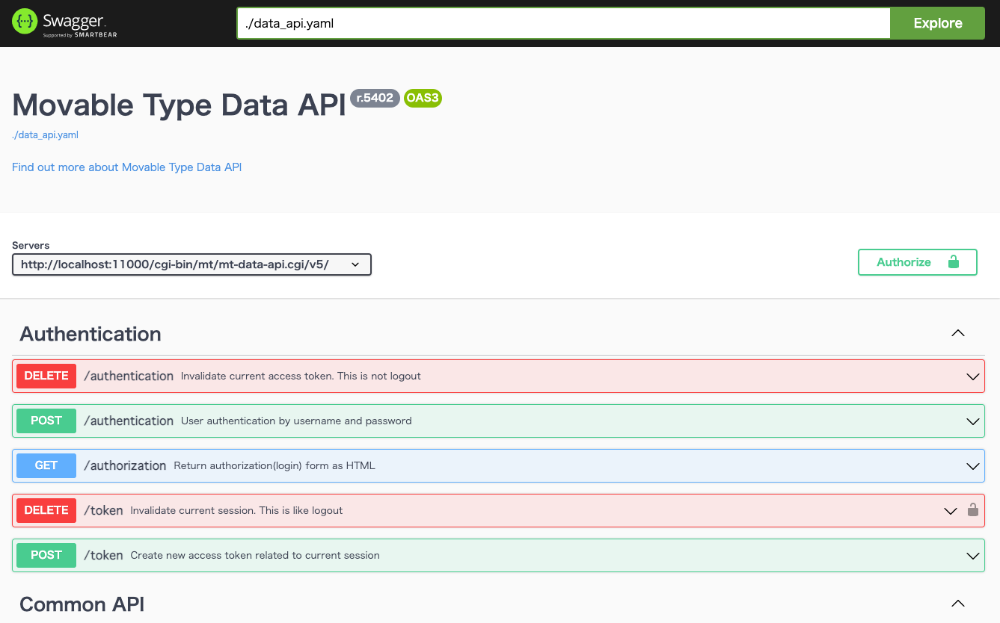
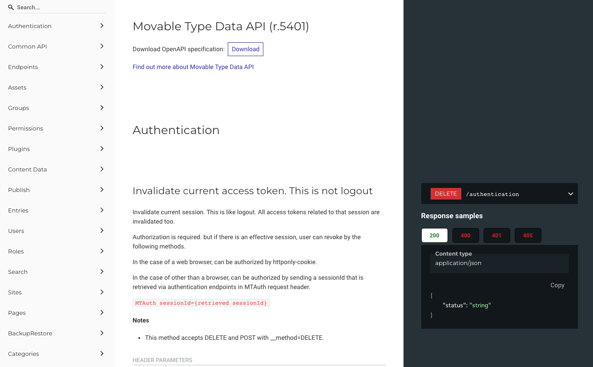

# Local development environment

- Docker
- Rocky Linux 8
- Apache
- MySQL 5.7
- Perl
- Movable Type
- Swagger
- Redocly

| 起動アプリケーション     | URL                               |
|----------------|-----------------------------------|
| Movable Type   | http://localhost:11000/cgi-bin/mt |
| Swagger Editor | http://localhost:8001             |
| Swagger UI     | http://localhost:8002             |
| Redocly Redoc  | http://localhost:8003             |

## Setup

1. .env.sampleを.envにリネーム
2. .env環境変数を設定
3. mt-settings/mt-config.cgiで設定したDB情報を入力
4. Movable Type本体のディレクトリ名をMT-7.0にしてzipにする
5. docker/mt-data 配下にMovable Typeをzipで配置

## docker compose command

Movable Type を配置して、docker compose で起動します。

### Build

必要なイメージをダウンロードを行い、設置したMovable Typeを配置し展開します。

```bash
./d-build.sh
```

### Start

```bash
./d-up.sh
```

### Shutdown

```bash
./d-down.sh
```

### Dump

ShutdownでDBは破棄されます。  
必要なデータはシャットダウンの前にDBのDumpを取ります。

以下のコマンドで `sql/test.sql` が生成されます。

```bash
./dump.sh test
```

再度起動する時は、 `env` ファイルに取り出した Dumpファイルを指定することで起動できます。

```dotenv
DUMP_FILE=test
```

### Login SSH Web

```
docker exec -it website-apache sh
```

### Login MySQL

```
docker exec -it website-db sh
```

## Swagger



Dockerを起動するとData API用のSwagger UIが表示します。
localhost:11000のMTに入ってるデータを確認する場合は、 `mt-config.cgi` に `DataAPICORSAllowOrigin` を設定します。

```cgi
DataAPICORSAllowOrigin http://localhost:8002/
```

## Redocly Redoc



Movalbe TypeのData APIのドキュメントでも利用しているRedoclyをローカルで参照可能です。

`data_api.sh` で最新APIのJSONを取得して、起動時に `openapi.json` を参照して閲覧できます。

### Data API OpenAPI

Data API のリポジトリからOpenAPIのJSONを取得するシェルスクリプトです。

```bash
./data_api.sh
```

シェルスクリプトを実行することで `./api/redoc/openapi.json` に配置します。

## Local Data Share

ローカルで構築したCMSのデータを共有する手順です。

1. 出力された画像などをzipにまとめる
2. git経由でzipデータを共有する（共有先は任意）
3. バックアップしたsqlを共有
4. zipを解凍して該当のドキュメントルートへ入れる
5. sqlをリストアしてデータベースを上書きする

```bash
# Backup
docker exec CONTAINER /usr/bin/mysqldump -u root --password=root DATABASE > backup.sql

# Restore
cat backup.sql | docker exec -i CONTAINER /usr/bin/mysql -u root --password=root DATABASE
```

## Remove Storage

Dockerで作成したStorageが残っていた場合は削除するコマンド

```bash
docker volume ls -qf dangling=true | xargs -J% docker volume rm %
```
