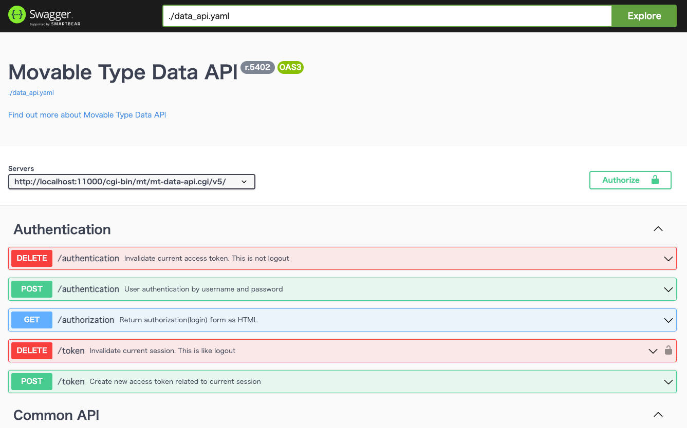
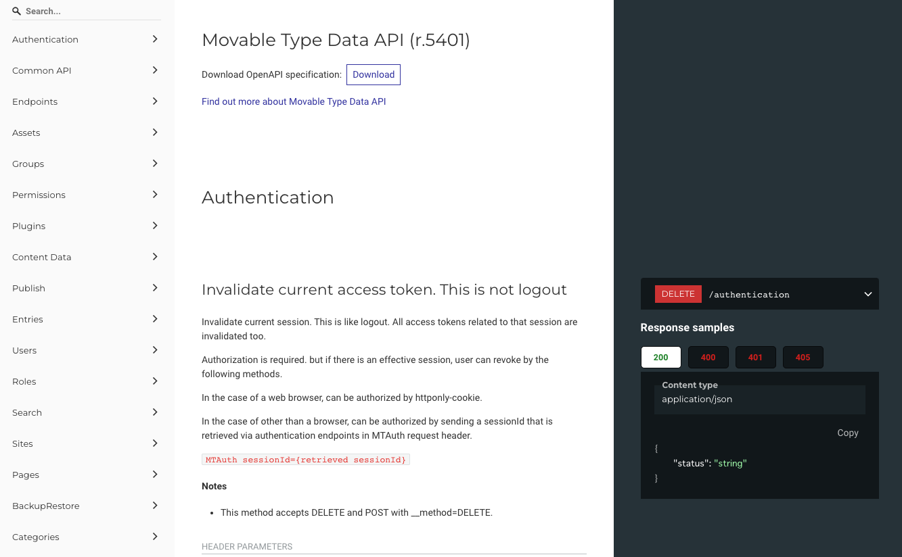

# Local development environment

- Docker
- Rocky Linux 9
- Apache
- MySQL 5.7
- Perl
- Movable Type
- Swagger
- Redocly

| 起動アプリケーション     | URL                                          |
|----------------|----------------------------------------------|
| Movable Type（cgi・デフォルト） | http://localhost:10000/cgi-bin/mt/mt.cgi     |
| Movable Type（psgi-dev） | http://localhost:5001/mt.cgi                 |
| Movable Type（psgi・骨格） | http://localhost:10000/cgi-bin/mt/mt.cgi     |
| Swagger Editor | http://localhost:8001                        |
| Swagger UI     | http://localhost:8002                        |
| Redocly Redoc  | http://localhost:8003                        |

## Setup

1. .env.sampleを.envにリネーム
2. .env環境変数を設定（既存の `.env` には `COMPOSE_PROFILES=cgi` を追加する）
3. mt-settings/mt-config.cgiで設定したDB情報を入力（PSGI モードは版ごとの設定ファイルも同様）
4. Movable Type本体のディレクトリ名をMT-7.0にしてzipにする
5. docker/mt-data 配下にMovable Typeをzipで配置

## docker compose command

Movable Type を配置して、docker compose で起動します。

### Build

必要なイメージをダウンロードを行い、設置したMovable Typeを配置し展開します。

```bash
./d-build.sh
```

### Start

```bash
./d-up.sh
```

`.env` の `COMPOSE_PROFILES=cgi` がデフォルトです。Apache CGI のまま起動します。

### 実行モード（CGI / PSGI 切替）

Compose profile で切り替えます。nginx リバースプロキシは対象外です（#23）。

| profile | 内容 | 管理画面 |
|---------|------|----------|
| `cgi` | 現行の Apache CGI（デフォルト） | http://localhost:10000/cgi-bin/mt/mt.cgi |
| `psgi-dev` | plackup 単体 | http://localhost:5001/mt.cgi |
| `psgi` | Apache リバースプロキシ + Starman（本番寄り骨格。未検証） | http://localhost:10000/cgi-bin/mt/mt.cgi |

MySQL（`./db-data`）と公開ディレクトリ（`./www/html`）はモード間で共有します。`CGIPath` / `StaticWebPath` だけ版ごとに分けています。

- cgi: `mt-settings/mt-config.cgi`
- psgi-dev: `mt-settings/mt-config.cgi.psgi-dev`
- psgi: `mt-settings/mt-config.cgi.psgi`

### 管理画面 URL

Movable Type は CGI スクリプト名単位で公開します。`psgi-dev` の `CGIPath` は `http://localhost:5001/` なので、管理画面は **`/mt.cgi`** です。`http://localhost:5001/` や `/mt` を開くと `Not Found` になります。

macOS の AirPlay レシーバーがホストの 5000 番を使うため、`psgi-dev` の公開ポートは `.env` の `APP_PORT`（デフォルト `5001`）です。

| 画面 | cgi / psgi | psgi-dev |
|------|------------|----------|
| 管理画面 | http://localhost:10000/cgi-bin/mt/mt.cgi | http://localhost:5001/mt.cgi |
| インストールウィザード | http://localhost:10000/cgi-bin/mt/mt-wizard.cgi | http://localhost:5001/mt-wizard.cgi |
| 環境チェック | http://localhost:10000/cgi-bin/mt/mt-check.cgi | http://localhost:5001/mt-check.cgi |
| アップグレード | http://localhost:10000/cgi-bin/mt/mt-upgrade.cgi | http://localhost:5001/mt-upgrade.cgi |
| Data API | http://localhost:10000/cgi-bin/mt/mt-data-api.cgi | http://localhost:5001/mt-data-api.cgi |
| サイト内検索 | http://localhost:10000/cgi-bin/mt/mt-search.cgi | http://localhost:5001/mt-search.cgi |
| コンテンツデータ検索 | http://localhost:10000/cgi-bin/mt/mt-cdsearch.cgi | http://localhost:5001/mt-cdsearch.cgi |
| コメント | http://localhost:10000/cgi-bin/mt/mt-comments.cgi | http://localhost:5001/mt-comments.cgi |
| 共有プレビュー | http://localhost:10000/cgi-bin/mt/mt-shared-preview.cgi | http://localhost:5001/mt-shared-preview.cgi |
| 静的ファイル（mt-static） | http://localhost:10000/cgi-bin/mt/mt-static/ | http://localhost:5001/mt-static/ |

切替例（ポートが重なるので、先に停止してから profile を変える）:

```bash
./d-down.sh
# .env の COMPOSE_PROFILES を cgi / psgi-dev / psgi のいずれかに変更
./d-up.sh
```

一時的に上書きする場合:

```bash
./d-down.sh
COMPOSE_PROFILES=psgi-dev ./d-up.sh
```

psgi-dev の初回は PSGI イメージのビルドが必要です。

```bash
COMPOSE_PROFILES=psgi-dev ./d-build.sh
```

PSGI はプロセス常駐です。プラグインを差し替えたあと、`psgi-dev` は plackup のファイル監視でリロードを試みます。効かない場合や `psgi`（Starman）ではコンテナの再起動が必要です。

```bash
docker compose restart web-psgi-dev
# または
docker compose restart psgi-app
```

`psgi` は設定と起動コマンドの骨格です。ブラウザ到達までの確認は `psgi-dev` を先に使ってください。

Swagger / Redoc はどのモードでも同じポートで起動します。

### Shutdown

コンテナを停止します。**MySQL データ (`./db-data`) と公開ファイル (`./www/html`) は残ります。**

```bash
./d-down.sh
```

再起動は `./d-up.sh` です。イメージの作り直しは不要です。

### Reset DB

MySQL データだけを消して作り直すときは、明示的に次を実行します。日常の停止には使いません。

```bash
./d-reset-db.sh --yes
```

`./db-data` を削除したあとコンテナを起動し直します。datadir が空のため、`.env` の `DUMP_FILE` で指定した `sql/<DUMP_FILE>.sql` が初期投入されます。`www/html` は削除しません。

### Dump

任意のタイミングでバックアップを取れます。停止の前に必須ではありません。

以下のコマンドで `sql/test.sql` が生成されます。

```bash
./dump.sh test
```

空の DB から dump を初期投入して起動する場合は、`.env` にファイル名（拡張子なし）を指定します。

```dotenv
DUMP_FILE=test
```

`DUMP_FILE` を空にすると `sql/.sql` を参照してしまいます。未設定時は `test_data_mysql` が使われます。

## プラグイン開発

開発用プラグインは **DocumentRoot (`www/html`) ではなく** 次の場所に置きます。

```
mt-settings/plugins/<PluginName>/
```

例: `mt-settings/plugins/MTMCP/config.yaml`

このディレクトリはコンテナの `/var/www/local/mt-dev-plugins` に bind mount され、`mt-config.cgi` の `PluginPath` から読み込まれます。zip 同梱のコアプラグイン (`/var/www/local/cgi-bin/mt/plugins`) は上書きしません。ホスト側が空ディレクトリでも、同名のコアプラグインは消えません。

ファイルを差し替えたあとは **再ビルド不要** です。CGI モードでは次のリクエストで新しいコードが使われます。PSGI モードは常駐のため、上記のリロード／再起動が必要です。MT 管理画面でプラグイン一覧が古い場合は、画面の再読み込みか `./d-up.sh` によるコンテナ再作成で足りることが多いです。

再ビルド (`./d-build.sh`) が必要なのは、MT 本体 zip の差し替えや `docker/Dockerfile` の変更時です。

### Login SSH Web

```
docker exec -it コンテナ名 /bin/bash
```

### Login MySQL

```
docker exec -it コンテナ名 /bin/bash
```

## Swagger



Dockerを起動するとData API用のSwagger UIが表示します。
localhost:10000のMTに入ってるデータを確認する場合は、 `mt-config.cgi` に `DataAPICORSAllowOrigin` を設定します。

```cgi
DataAPICORSAllowOrigin http://localhost:8002/
```

## Redocly Redoc



Movalbe TypeのData APIのドキュメントでも利用しているRedoclyをローカルで参照可能です。

`data_api.sh` で最新APIのJSONを取得して、起動時に `openapi.json` を参照して閲覧できます。

### Data API OpenAPI

Data API のリポジトリからOpenAPIのJSONを取得するシェルスクリプトです。

```bash
./data_api.sh
```

シェルスクリプトを実行することで `./api/redoc/openapi.json` に配置します。

## Local Data Share

ローカルで構築したCMSのデータを共有する手順です。

1. 出力された画像などをzipにまとめる
2. git経由でzipデータを共有する（共有先は任意）
3. バックアップしたsqlを共有
4. zipを解凍して該当のドキュメントルートへ入れる
5. sqlをリストアしてデータベースを上書きする

```bash
# Backup
docker exec CONTAINER /usr/bin/mysqldump -u root --password=root DATABASE > backup.sql

# Restore
cat backup.sql | docker exec -i CONTAINER /usr/bin/mysql -u root --password=root DATABASE
```

## Remove Storage

Dockerで作成したStorageが残っていた場合は削除するコマンド

```bash
docker volume ls -qf dangling=true | xargs -J% docker volume rm %
```
